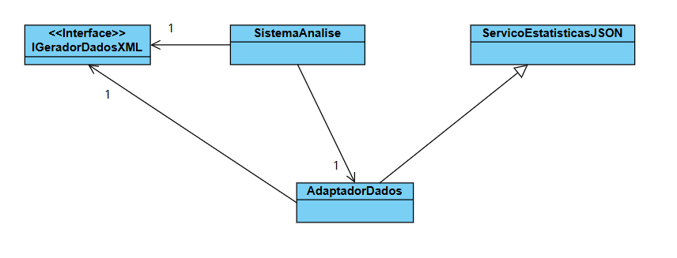

# Padrão Adapter em Java: Adaptador de Gerador de Dados (JSON - XML)
Este projeto apresenta uma implementação prática do Padrão de Projeto Estrutural Adapter (Adaptador) em Java. O objetivo principal é permitir que um sistema moderno (o Cliente) possa consumir dados de um serviço legado (Adaptada) que utiliza um formato incompatível, resolvendo o problema de integração sem a necessidade de alterar o código de nenhuma das partes.

## Contexto do Problema
O cenário modelado envolve um Sistema de Análise de Dados que está configurado para trabalhar exclusivamente com relatórios no formato XML. No entanto, a única fonte de dados disponível é um Serviço de Estatísticas Legado que, devido à sua arquitetura antiga, só consegue gerar os dados no formato JSON.

Para resolver essa incompatibilidade, criamos o AdaptadorDados, que funciona como uma ponte: ele simula ser um fornecedor de XML para o sistema moderno, mas internamente, chama o serviço JSON e realiza toda a tradução necessária.

## Estrutura do Padrão
O projeto segue a estrutura do Adapter de Objeto (Composition) e é composto por quatro partes principais:

- **Alvo (Target):** A interface IGeradorDadosXML. Esta é a interface que o Cliente (SistemaAnalise) espera usar, definindo o método gerarDadosEmXML().

- **Adaptada (Adaptee/Legada):** A classe ServicoEstatisticasJSON. Esta é a classe existente e inflexível, que possui o método gerarDadosEmJSON(), formatando a saída de maneira que o Cliente não entende.

- **Adaptador (Adapter):** A classe AdaptadorDados. Esta é a peça central do padrão. Ela implementa a interface IGeradorDadosXML e contém uma referência à ServicoEstatisticasJSON. É aqui que a mágica da tradução acontece, convertendo os dados JSON para XML.

- **Cliente (Client):** A classe SistemaAnalise. Ela utiliza a interface Alvo (IGeradorDadosXML) para obter os dados em XML, permanecendo completamente isolada e alheia ao fato de que os dados foram originalmente gerados em JSON.

## Diagrama de Classes

